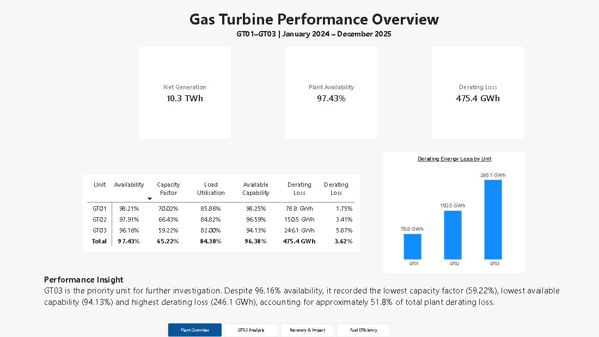
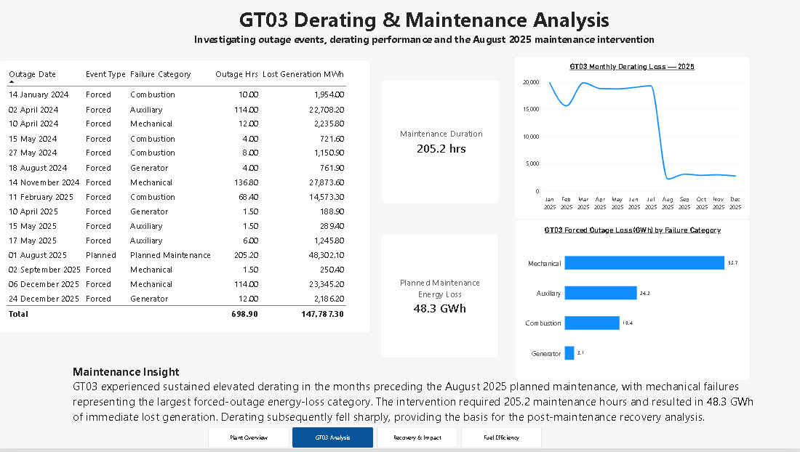
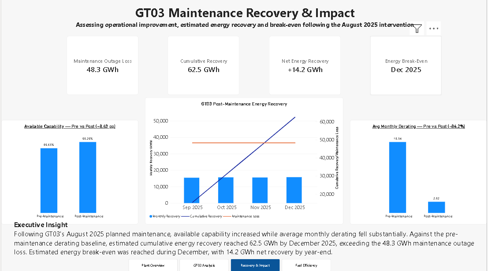
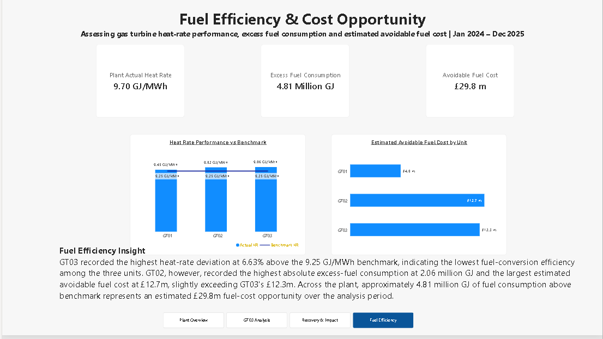

# Gas Turbine Performance, Maintenance & Fuel Efficiency Analytics

## Project Overview

This Power BI project analyses the operational performance of three gas turbine generating units (GT01–GT03) over a 24-month period from January 2024 to December 2025.

The analysis integrates generation performance, availability, capacity utilisation, derating losses, outage events, maintenance intervention, post-maintenance recovery, heat-rate efficiency and fuel-cost performance to provide an end-to-end view of plant performance.

The analysis initially identified GT03 as the principal reliability and derating concern. This led to a deeper investigation of its August 2025 planned maintenance intervention and an assessment of whether the resulting performance recovery justified the associated outage energy loss.

The project then extends beyond reliability into thermal efficiency, quantifying heat-rate deviation, excess fuel consumption and estimated avoidable fuel cost across all three units.

## Business Questions

The analysis was designed to answer the following questions:

1. How are the three gas turbine units performing across availability, capacity factor, load utilisation and derating?
2. Which unit represents the greatest operational performance concern?
3. What outage and failure patterns contribute to GT03's performance losses?
4. Did the August 2025 GT03 maintenance intervention result in measurable performance improvement?
5. How much energy was potentially recovered following the maintenance intervention?
6. When did estimated cumulative energy recovery exceed the energy lost during the maintenance outage?
7. How efficiently are the units converting fuel into electricity relative to the heat-rate benchmark?
8. Which units represent the greatest excess-fuel and fuel-cost improvement opportunities?

## Analytical Approach

The project follows a progressive analytical workflow:

**Plant Performance → Problem Identification → Outage & Derating Analysis → Maintenance Intervention → Post-Maintenance Recovery → Energy Break-Even → Heat-Rate Benchmarking → Fuel-Cost Opportunity**

This approach connects operational reliability, maintenance effectiveness and thermal efficiency rather than evaluating each performance area in isolation.

## Dashboard Pages

### 1. Plant Performance Overview

Provides a plant-level comparison of GT01–GT03 using generation, availability, capacity factor, load utilisation, available capability and derating-loss indicators.

The analysis identified GT03 as the priority unit for further investigation. Despite 96.16% availability, GT03 recorded the lowest capacity factor (59.22%), lowest available capability (94.13%) and the highest derating loss at 246.1 GWh, representing approximately 51.8% of total plant derating loss.

### 2. GT03 Derating & Maintenance Analysis

Investigates GT03 outage events, failure categories and monthly derating performance leading to the August 2025 planned maintenance intervention.

GT03 experienced sustained elevated derating before the intervention, while mechanical failures represented the largest forced-outage energy-loss category. The planned maintenance required 205.2 hours and resulted in approximately 48.3 GWh of immediate lost generation.

### 3. GT03 Maintenance Recovery & Impact

Evaluates GT03 performance before and after the August 2025 maintenance intervention.

Available capability increased from 89.65% to 98.29%, an improvement of 8.63 percentage points, while average monthly derating declined from approximately 18.54 GWh to 2.92 GWh — an 84.2% reduction.

Estimated cumulative energy recovery reached approximately 62.5 GWh by December 2025, exceeding the 48.3 GWh maintenance outage loss and producing approximately 14.2 GWh of estimated net energy recovery. Energy break-even was reached during December 2025.

### 4. Fuel Efficiency & Cost Opportunity

Extends the analysis to thermal efficiency by comparing actual heat rate with a 9.25 GJ/MWh benchmark.

GT03 recorded the highest heat-rate deviation at 6.63% above benchmark. GT02, however, recorded the highest absolute excess-fuel consumption at approximately 2.06 million GJ and the largest estimated avoidable fuel cost at approximately £12.7 million.

Across the plant, approximately 4.81 million GJ of fuel consumption above benchmark represents an estimated £29.8 million fuel-cost opportunity over the analysis period.

## Key Findings

- GT03 emerged as the principal reliability and derating concern, accounting for approximately **51.8% of total plant derating loss**.
- Following the August 2025 planned maintenance intervention, GT03 available capability increased from **89.65% to 98.29% (+8.63 percentage points)**.
- GT03 average monthly derating loss declined from approximately **18.54 GWh to 2.92 GWh**, representing an **84.2% reduction**.
- Estimated cumulative post-maintenance energy recovery reached **62.5 GWh** by December 2025, exceeding the **48.3 GWh maintenance outage loss**.
- Estimated energy break-even was achieved during **December 2025**, with approximately **14.2 GWh net energy recovery** by year-end.
- GT03 recorded the highest heat-rate deviation at **6.63% above the 9.25 GJ/MWh benchmark**.
- GT02 recorded the highest absolute excess-fuel consumption at approximately **2.06 million GJ** and the largest estimated avoidable fuel cost at approximately **£12.7 million**.
- Across the three units, benchmark-based excess fuel was approximately **4.81 million GJ**, representing an estimated **£29.8 million fuel-cost opportunity** over the analysis period.

## Recommendations

1. **Sustain GT03 post-maintenance performance** by monitoring available capability, monthly derating and outage recurrence to confirm that the observed recovery is maintained.

2. **Prioritise GT03 heat-rate optimisation.** Although reliability and capability improved substantially following maintenance, GT03 continues to show the largest heat-rate deviation from benchmark.

3. **Investigate GT02's fuel-cost opportunity.** GT02 recorded the highest absolute excess-fuel consumption and estimated avoidable fuel cost despite having a slightly better heat rate than GT03.

4. **Integrate heat-rate variance, excess fuel and estimated fuel-cost exposure into routine plant performance reporting** so that reliability and thermal-efficiency opportunities can be assessed together.

## Tools & Analytical Skills

- **Power BI** — dashboard development, interactive reporting and data visualisation
- **Power Query** — data preparation and transformation
- **DAX** — KPI development, filter context, pre/post analysis and cumulative calculations
- **Dimensional Modelling** — date and unit dimensions supporting consistent analysis
- **Performance Benchmarking** — actual versus benchmark heat-rate analysis
- **Maintenance Effectiveness Analysis** — pre/post intervention performance comparison
- **Energy Recovery Analysis** — cumulative avoided derating and energy break-even assessment
- **Commercial Analysis** — translating excess fuel consumption into estimated fuel-cost opportunity

## Key Measures Developed

Selected analytical measures include:

- Available Capability %
- Derating Loss MWh / GWh
- Derating Loss %
- Pre-Maintenance Average Monthly Derating
- Post-Maintenance Average Monthly Derating
- Derating Reduction %
- Monthly Avoided Derating
- Cumulative Energy Recovery
- Net Maintenance Recovery
- Energy Break-Even
- Actual Heat Rate GJ/MWh
- Benchmark Heat Rate GJ/MWh
- Heat Rate Variance %
- Benchmark Fuel Requirement
- Excess Fuel GJ
- Estimated Avoidable Fuel Cost

## Assumptions & Limitations

This project is an analytical case study designed to demonstrate power-generation performance analysis using Power BI.

Post-maintenance energy recovery is estimated relative to the pre-maintenance derating baseline and should not be interpreted as metered incremental generation attributable solely to the maintenance intervention.

Similarly, excess fuel and avoidable fuel cost are benchmark-based analytical estimates. They represent potential efficiency opportunities rather than audited or guaranteed realised savings.

Operational factors such as ambient conditions, dispatch requirements, fuel quality, start-stop cycles, equipment condition and other plant constraints may also influence actual performance.

## Project File

The complete Power BI report is available in this repository:

`Gas_Turbine_Performance_Maintenance_Fuel_Efficiency_Analytics.pbix`

---

### Author

**Ndubuisi Anozie**

Power Generation Performance | Business & Data Analytics | Power BI
